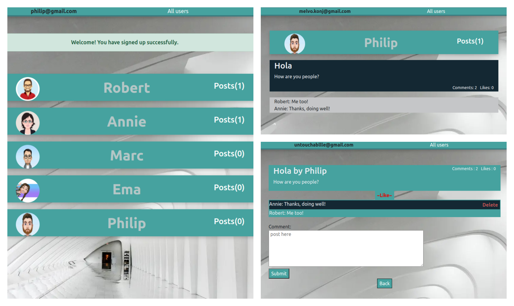

# Blog App
Amazing Blog app made with Ruby on Rails. User can make posts, comments and likes on posts of other users. Also user can delete posts and comments created by user. User can edit profile and delete account if not happy. For creating posts and comments user must login. Admin can manage all.

## Live preview
  Under construction

## Blog App screenshot

## General info
This is project made with Ruby on Rails.

 ## Technologies
Project is created with:
* Language - Ruby
* Framework - Ruby on Rails
* PostgreSQL

## Setup
To run this project, install it locally using:
- cd Desktop
- git clone https://github.com/VuDej/Blog.git
- cd Blog
- bundle install
- rails server
- in your browser open url : https://localhost:3000 to view the app.

## Author

👤 **Dejan Vujovic**

- Github : [@VuDej](https://github.com/VuDej)
- Twitter: [@DejanVuj](https://twitter.com/DejanVuj)
- LinkedIn : [@Dejan-Vujovic](https://www.linkedin.com/in/dejan-vujovic-5a0672225/)

## 🤝 Contributing

Contributions, issues, and feature requests are welcome!

Feel free to check the [issues page](https://github.com/VuDej/School-Library-Ruby/issues/1).

## Show your support

Give a ⭐️ if you like this project!

## 📝 License

This project is [MIT](LICENSE) licensed.

## Contact
Created by [@VuDej](https://github.com/VuDej)
